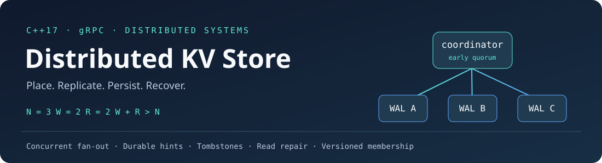
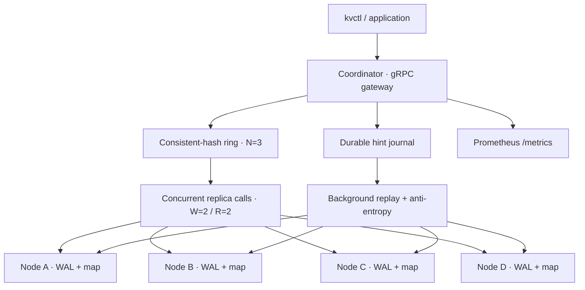
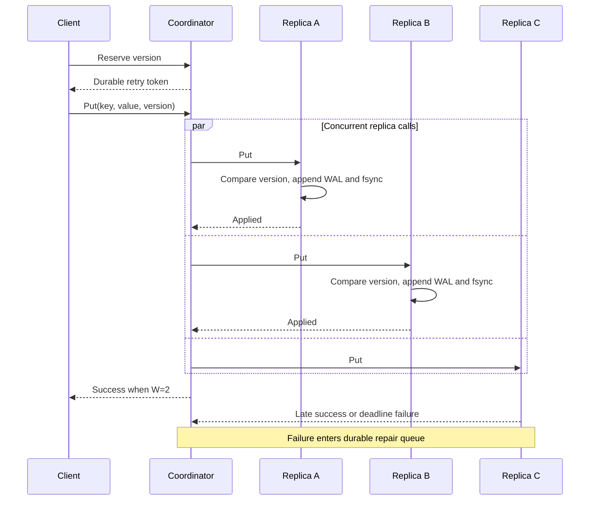

<div align="center">
  

  <p>A C++ database project that makes failure, durability, and consistency visible.</p>

  <a href="https://github.com/inceptionabhishek/distributed-kv-store/actions/workflows/build-and-test.yml"></a>
  
  
  
  
  

  <p><a href="#quick-start">Run it</a> · <a href="#watch-a-node-fail-and-recover">Failure demo</a> · <a href="docs/DESIGN.md">Design decisions</a> · <a href="docs/INTERVIEW_GUIDE.md">Interview guide</a></p>
</div>

## What this project demonstrates

A Dynamo-inspired key-value store with independent gRPC storage processes and one authoritative coordinator. A key is placed on three distinct nodes using consistent hashing. A write returns when two replicas acknowledge it; a read reconciles two replies. The remaining replica catches up through durable hints and repair.

The implementation follows a mutation through its complete lifecycle: **placement → quorum → WAL → restart → repair → migration**.

| Capability | Implementation |
|---|---|
| Data placement | Deterministic 64-bit FNV-1a + mixing; 100 virtual points per node by default |
| Quorum replication | Configurable N/W/R; validates W + R > N |
| Concurrent coordination | Bounded C++ worker pool, early quorum completion, late write replication |
| Deadline handling | Operation and replica deadlines; parent gateway deadline propagated; excess reads cancelled |
| Version ordering | Hybrid clock + writer identity; explicit applied/duplicate/stale/conflict outcomes |
| Safe deletion | Versioned tombstones replicated and repaired like values |
| Crash recovery | Checksummed WAL, incomplete-tail recovery, atomic snapshots, directory ownership lock |
| Durability choices | always / periodic / memory |
| Replica recovery | Durable hints, latest-version compaction, retry backoff, asynchronous read repair |
| Anti-entropy | Periodic streamed full scans that repair keys clients never read |
| Membership | Persisted ring epochs, quiesced data migration, graceful decommission |
| Operations | CLI, structured coordinator logs, Prometheus endpoint, local process manager |
| Deployment | Docker Compose cluster with named data volumes; optional Prometheus |
| Validation | Unit tests, real gRPC integration tests, fault injection, SIGKILL recovery, sanitizer option |

This is an educational storage system with explicit boundaries: LWW eventual reconciliation, one authoritative coordinator, full-scan repair and retained tombstones. It does not claim transactions or linearizability.

## Architecture



The cluster normally contains four physical nodes. Each key has three replicas: **cluster size is not the replication factor**. Storage nodes do not elect leaders or route requests; the coordinator owns routing, quorum reconciliation and membership changes.

## Quick start

### Build locally

Requirements: C++17 compiler, CMake, gRPC, Protobuf, GoogleTest and Python 3 for the demonstration scripts.

macOS / Homebrew:

```bash
brew install cmake grpc protobuf googletest
```

Ubuntu:

```bash
sudo apt-get update
sudo apt-get install -y build-essential cmake pkg-config libgrpc++-dev \
  protobuf-compiler-grpc libprotobuf-dev protobuf-compiler libgtest-dev python3
```

```bash
cmake -S . -B build -DCMAKE_BUILD_TYPE=Release
cmake --build build --parallel 4
ctest --test-dir build --output-on-failure --timeout 30
python3 scripts/cluster.py up
```

The manager starts four durable storage nodes at ports 50051–50054 and the coordinator at 50050. It stores process records, logs and data beneath `.data/local/`. It preserves those files on shutdown.

```bash
./build/kvctl put user:1 abhishek
./build/kvctl get user:1
./build/kvctl replicas user:1
./build/kvctl delete user:1
./build/kvctl metrics
python3 scripts/cluster.py down
```

CLI exit codes: 0 success, 1 transport/usage error, 2 rejected mutation/admin operation, 3 key not found. A missing key is distinct from a failed read quorum.

### Docker Compose

```bash
docker compose up --build -d
docker compose exec router kvctl put user:1 abhishek
docker compose exec router kvctl get user:1
docker compose exec router kvctl replicas user:1
docker compose down
```

Inside the router container, add `--address localhost:50050` if overriding the CLI default. Host clients use `localhost:50050`. Inside the cluster, replicas have addresses such as `node2:50051`, not host-mapped port 50052.

Named volumes preserve WALs, snapshots, hints and membership across container restarts. The image runs as a non-root user and executes the tests during its build.

## Watch a node fail and recover

The automated demonstration creates its own temporary data directory and uses ports 52050–52054:

```bash
python3 scripts/demo.py
```

It performs a quorum write, kills one of that key's actual replicas with SIGKILL, writes successfully during the outage, restarts the coordinator, recovers the storage process, verifies the missing version arrives, and deletes the key with a tombstone. It shuts down its own processes and removes its temporary demo data afterward.

Expected final output:

```text
PASS: writes, failure, router restart, replica recovery and deletion
```

For a manual experiment, first use `kvctl replicas KEY` to choose a replica of your key:

```bash
python3 scripts/cluster.py kill node2
./build/kvctl put user:2 "written during outage"
./build/kvctl metrics
python3 scripts/cluster.py restart router
python3 scripts/cluster.py restart node2
./build/kvctl repair
```

Inject a slow replica or failed data requests:

```bash
python3 scripts/cluster.py --delay-ms 1000 restart node2
python3 scripts/cluster.py --fail-every 2 restart node3
# Restore normal service:
python3 scripts/cluster.py restart node2
python3 scripts/cluster.py restart node3
```

Heartbeats are suspicions, not proof of failure. A node can answer Ping while its data RPCs are slow; request deadlines still protect the quorum path.

## Read, write and retry semantics



Versions compare lexicographically as `(physical_ms, logical_counter, writer_id)`. The logical counter handles same-millisecond writes and local wall-clock rollback; the writer ID breaks ties between independent writers.

The node accepts a newer version, acknowledges an identical retry, rejects a stale version, and rejects equal-version payload changes. A delete writes a tombstone rather than erasing the record. Reads choose the highest version, including tombstones, from a responding quorum and queue repair for stale or unobserved replicas.

`kvctl` prints a version before dispatch. Retry the identical mutation with that token:

```bash
./build/kvctl put order:42 shipped
# Copy the version printed by the preceding command:
./build/kvctl --version PHYSICAL:LOGICAL:WRITER put order:42 shipped
```

A quorum failure is **not a rollback**. A replica may already have applied the version, or a stored hint may apply it later. Reusing the token is safe; a new token represents a new mutation.

## Persistence

Storage defaults to `--durability always`.

| Mode | Before acknowledgement | After an abrupt restart |
|---|---|---|
| always | Append WAL + fsync | Recover acknowledged replica records |
| periodic | Append WAL; fsync worker targets 100 ms | Recent records can be lost |
| memory | Update map only | All local records are lost |

```bash
./build/kv_server --port 50051 --data .data/node1 --durability always
./build/kv_server --port 50052 --data .data/node2 --durability periodic
./build/kvctl --address localhost:50051 snapshot
```

The WAL uses length-prefixed checksummed frames. Recovery truncates an incomplete final append, but fails closed on a complete corrupted frame. Snapshots are synced and atomically published before the WAL is truncated. Values, versions and tombstones all survive snapshots.

Hints have their own fsynced journal, retain only the latest version for each target/key, survive coordinator restart, and remain queued after failed replay. The default hint TTL is 24 hours. Tombstones have **no expiry**; this implementation does not pretend that a fixed TTL makes tombstone garbage collection safe.

## Membership and rebalancing

A new node receives the data its candidate ring assigns before the coordinator activates the new membership epoch.

```bash
# Start the additional node in another terminal:
./build/kv_server --port 50055 --data .data/node5 --durability always

# Ask the existing coordinator to migrate and activate epoch 2:
./build/kvctl --timeout-ms 60000 reconfigure 2 \
  localhost:50051,localhost:50052,localhost:50053,localhost:50054,localhost:50055

# Gracefully decommission it after migrating back to four nodes:
./build/kvctl --timeout-ms 60000 reconfigure 3 \
  localhost:50051,localhost:50052,localhost:50053,localhost:50054
```

The manager uses `127.0.0.1` seed addresses; use those same address strings in reconfiguration to preserve the existing node identities and ring placement. Epochs must increase beyond the current value shown by `kvctl replicas KEY`.

Migration pauses coordinator admission, drains in-flight work, scans old and new members, copies newest values and tombstones to every new owner, and persists the epoch before cutover. Every old and new node must be reachable. An interrupted copy leaves the old ring active. Old extra copies are retained.

This is a controlled single-coordinator migration. It does not implement gossip, automatic failed-node replacement, multiple independently reconfiguring routers, or an online dual-write cutover.

## Observability

Run the coordinator with an HTTP metrics endpoint:

```bash
./build/kv_router --serve 50050 --nodes localhost:50051,localhost:50052,localhost:50053,localhost:50054 \
  --data .data/router --metrics-port 9090 --verbose 1
curl http://localhost:9090/metrics
```

Docker publishes coordinator metrics at 9090 and storage metrics at 9091–9094. Optional Prometheus:

```bash
docker compose --profile monitoring up -d
```

Open [Prometheus](http://localhost:9095). Useful expressions:

```promql
rate(kv_quorum_failures_total[1m])
kv_hints_pending
histogram_quantile(0.99, sum by (le) (rate(kv_request_latency_seconds_bucket{job="kv-coordinator"}[1m])))
rate(kv_wal_fsync_seconds_sum[1m]) / rate(kv_wal_fsync_seconds_count[1m])
```

Metrics distinguish quorum failures, RPC failures, deadline expiry, repair scheduling and queue rejection. Structured coordinator logs include operation, key hash, success and version time/counter. No raw values are logged.

## Benchmarks you can reproduce

A short verification run on macOS ARM64 used four storage processes with always/fsync durability, eight client threads, 1,000 keys, a 50/50 read/write split, and three two-second trials per mode:

| Mode | Mean successful ops/sec | Run-to-run standard deviation | Quorum failures |
|---|---:|---:|---:|
| Sequential | 10,703 | 612 | 0 |
| Concurrent + early quorum | 12,697 | 435 | 0 |

The concurrent mode improved mean successful throughput by approximately **18.6%** in this short sample. Five concurrent-version stale rejections across all six trials are recorded separately from availability failures. Tail latency varied, including one 91 ms maximum in the concurrent runs; improved throughput does not guarantee every tail-latency measure improves. These are verification results, not a capacity claim. [Raw measurements](docs/benchmark-results.json) include every trial and sample percentile.

```bash
./build/benchmark 8 10 1000 0.5 --mode concurrent
./build/benchmark 8 10 1000 0.5 --mode sequential
python3 scripts/benchmarks.py --runs 5 --duration 10
```

The benchmark checks prepopulation, uses fixed seeds, synchronizes worker start, separates successful operations from failures, and reports successful throughput plus estimated p50/p95/p99 latency. It classifies stale rejections, conflicts and quorum failures separately. Sequential mode serializes all replica calls; concurrent mode combines fan-out with early quorum completion, so this comparison measures both changes. Per-worker reservoirs cap retained samples at 100,000. The repeated runner alternates modes and writes raw JSON, standard deviation and a normal-approximation confidence interval.

For Docker nodes, supply their host addresses via `--nodes`; benchmark processes talk directly to replicas. Benchmark router state is in memory, anti-entropy is disabled to isolate foreground work, and hint replay remains enabled. Record the storage durability mode separately.

These are closed-loop local microbenchmarks: they exclude queueing before a worker chooses a request, exhibit coordinated omission, and do not model WAN behavior. When reservoir sampling activates, merged worker samples are not perfectly weighted if workers complete different numbers of operations. Always report hardware, durability, errors, workload and repeated-run variation alongside numbers.

The original prototype's “degraded cluster is faster” result is preserved in [HISTORY.md](docs/HISTORY.md). Those historical numbers describe the old sequential memory-only implementation; they are not current performance claims.

## Validation

```bash
ctest --test-dir build --output-on-failure --timeout 30

cmake -S . -B build-asan -DCMAKE_BUILD_TYPE=Debug -DKV_SANITIZERS=ON
cmake --build build-asan --parallel 4
ASAN_OPTIONS=detect_leaks=0 ctest --test-dir build-asan --output-on-failure --timeout 30
```

The 64-test suite covers:

- Local concurrent access, absence versus empty value, deterministic version ordering and duplicate handling.
- Ring determinism, distinct replicas, load distribution and limited key movement.
- WAL/snapshot restart, partial-tail recovery, corruption detection and directory locking.
- Durable hints, retry backoff, expiry and protection against an old replay removing a new hint.
- One/two replica failures, slow replicas, propagated deadlines and cancelled reads.
- Read repair, automatic replay, unread-key anti-entropy and concurrent-write convergence.
- Tombstone repair, migration/decommission and persisted membership restoration.
- Acknowledged data surviving a real storage process SIGKILL.

GitHub Actions builds release/debug-with-symbols configurations with and without address/undefined-behavior sanitizers and runs the process demo on the non-sanitized job.

## Repository map

```text
proto/kvstore.proto            Network API and admin operations
include/version.hpp           Ordered versions and hybrid clock
include/consistent_hash_ring.hpp
include/thread_pool.hpp       Bounded concurrent execution
include/router.hpp            Coordinator API
src/coordinator.cpp           Quorums, repair, hints and membership
src/kv_store.cpp              Local versioned register map
src/journal.cpp               WAL framing, fsync, snapshots and recovery
src/hint_queue.cpp            Durable target/key repair queue
src/node_service.cpp          Storage gRPC service and fault controls
src/kvctl.cpp                 User/admin CLI and retry tokens
src/metrics_http.cpp          Prometheus HTTP endpoint
src/benchmark.cpp             Workload and latency measurements
scripts/cluster.py            Local process lifecycle
scripts/demo.py               End-to-end failure/recovery demo
scripts/benchmarks.py          Repeated measurements and raw results
tests/                        Unit, gRPC and process-crash tests
monitoring/prometheus.yml     Optional scrape configuration
docs/DESIGN.md                Guarantees and design decisions
docs/INTERVIEW_GUIDE.md        Explanation, questions and resume wording
```

CMake generates Protobuf/gRPC sources into `build/generated/`. Checked-in `generated/` files are reference outputs and are not used by the build.

## Boundaries and next engineering steps

The current guarantees depend on surviving copies, trusted clients, a stable replica universe during normal operation and one authoritative coordinator. LWW chooses one value rather than preserving siblings. A process crash is tested; disk loss or simultaneous destruction of every replica is not recoverable.

Repair scans are bounded at 100,000 records per node. The store uses one mutex. Snapshots pause local writes. Hints can grow across distinct keys during an extended outage. Membership migration pauses requests and requires reachable old members. Tombstones and obsolete non-owner copies are retained. No TLS, authentication, distributed transactions or consensus-based membership is implemented.

The next meaningful extensions are incremental/Merkle anti-entropy, sharded locks, WAL group commit, node-side epoch fencing, online migration and safe tombstone/obsolete-copy collection.

For a walkthrough of the exact guarantees and tradeoffs, read [DESIGN.md](docs/DESIGN.md). For an interview-ready explanation, use [INTERVIEW_GUIDE.md](docs/INTERVIEW_GUIDE.md).
